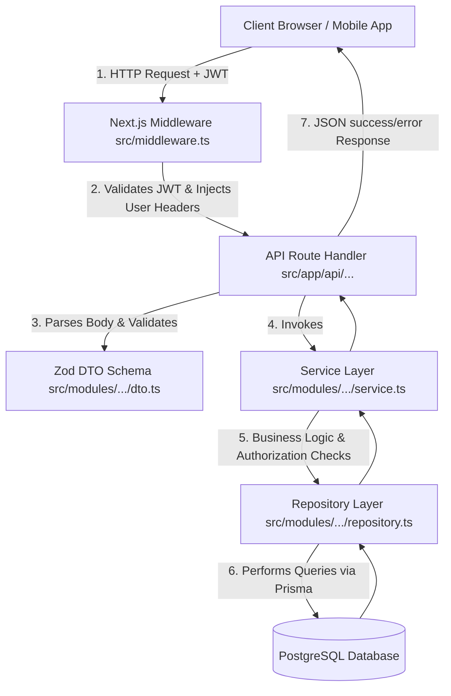

# PrepPortal Backend Architecture & Developer Guide

Welcome to the **PrepPortal** backend repository. This document explains the system's core architecture, design patterns, file structure, database modeling, and developer workflow guidelines. It is designed to help you and your team quickly understand the codebase and work on modules independently.

---

## 🚀 1. Tech Stack Overview

PrepPortal is built on a modern, robust, type-safe stack:

*   **Runtime & Framework**: [Next.js 15](https://nextjs.org/) (App Router) for API endpoints and server-rendered logic.
*   **Language**: [TypeScript](https://www.typescript.org/) with strict type checking enabled (`"strict": true` in [tsconfig.json](file:///Users/adityaverma/Desktop/PrepPortal/tsconfig.json)).
*   **ORM**: [Prisma Client](https://www.prisma.io/) v5.22+ for type-safe database queries.
*   **Database**: PostgreSQL for ACID-compliant, relational data storage.
*   **Validation**: [Zod](https://zod.dev/) for runtime input/payload schemas and strict API validation.
*   **Authentication**: Stateless JSON Web Tokens (JWT) verified via custom Edge Middleware.

---

## 🏗️ 2. Core Architectural Patterns

PrepPortal employs a **Modular Monolithic Architecture** structured around the **Service-Repository Pattern**. This guarantees a clean separation of concerns:



### A. Routing & Validation Layer
API routes reside in the `src/app/api/` folder. They do **not** contain business logic. Their responsibility is:
1. Extract the request payload/parameters.
2. Validate the payload using a Zod Schema defined in the module's `dto.ts`.
3. Call the relevant Service method.
4. Format the output with uniform success or error JSON responses.

### B. Business Logic (Service Layer)
Services (e.g. [bookmarkService](file:///Users/adityaverma/Desktop/PrepPortal/src/modules/bookmark/service.ts)) are the brain of the application. They coordinate business workflow rules, perform authorization checks (e.g. checking permissions), and orchestrate repository calls.

### C. Data Access (Repository Layer)
Repositories (e.g. [bookmarkRepository](file:///Users/adityaverma/Desktop/PrepPortal/src/modules/bookmark/repository.ts)) wrap all database operations. They isolate the service layer from direct query semantics, database schemas, and ORM details.

### D. Centralized Error Handling
API handlers are wrapped in the `apiHandler` higher-order function from [src/common/errors.ts](file:///Users/adityaverma/Desktop/PrepPortal/src/common/errors.ts).
*   Any unhandled exception is caught, logged, and returned as a standard JSON error payload:
    ```json
    {
      "success": false,
      "message": "Error description here",
      "error": {
        "message": "Error description here",
        "details": null,
        "code": "ERROR_CODE"
      }
    }
    ```
*   Special custom errors (e.g., `NotFoundError`, `ForbiddenError`, `ValidationError`) mapped to appropriate HTTP status codes (404, 403, 400).
*   Prisma database constraints (like duplicate keys) are caught and handled gracefully.

### E. Authentication & Authorization Flow
*   **Authentication**: Managed globally in Next.js edge-compatible [middleware.ts](file:///Users/adityaverma/Desktop/PrepPortal/src/middleware.ts).
    *   Intercepts incoming `/api/:path*` requests (excluding public routes like login/register).
    *   Decodes the JWT token from the `Authorization: Bearer <token>` header or `auth-token` cookie.
    *   Injects the parsed token payload directly into request headers: `x-user-id`, `x-user-email`, `x-user-role`, `x-user-permissions`.
*   **Role-Based Access Control (RBAC)**:
    *   Basic path-based route checking happens in [middleware.ts](file:///Users/adityaverma/Desktop/PrepPortal/src/middleware.ts) (e.g., `/api/admin` requires `ADMIN` or `SUPER_ADMIN` role).
    *   Granular controller-level protection is enforced using helper functions `getUserContext` and `enforceRole` in [src/common/auth-helper.ts](file:///Users/adityaverma/Desktop/PrepPortal/src/common/auth-helper.ts).

---

## 📂 3. Codebase Structure

The directory layout enforces modularity. Code is organized under domain-specific feature folders rather than technology-type folders:

```
PrepPortal/
├── prisma/
│   └── schema.prisma        # Database schema definitions and relations
├── src/
│   ├── app/
│   │   └── api/             # Next.js Route Handlers (API Endpoints)
│   ├── common/              # Shared utilities (errors, auth-helpers, query parse)
│   ├── lib/                 # Third-party wrappers (e.g. Prisma client instantiator)
│   ├── middleware.ts        # Next.js authentication middleware & JWT validator
│   └── modules/             # Core domains (Encapsulating DTOs, Services, Repositories)
│       ├── analytics/       # Dynamic subject completion & admin stats
│       ├── auth/            # Registration, login, JWT token emission
│       ├── bookmark/        # Saving tests and questions to workspace bookmarks
│       ├── company/         # Target preparation company setup
│       ├── question/        # Multi-type questions (theory, debug, mcq) bank
│       ├── roadmap/         # Workspace roadmaps and unlock sequences
│       ├── subject/         # Subjects containing topics
│       ├── subtopic/        # Detailed subtopics inside topics
│       ├── test/            # Assessment test instantiations and submissions
│       ├── topic/           # Topics with prerequisites mappings
│       └── workspace/       # Multi-workspace tenant state isolation
```

---

## 🗄️ 4. Database Schema & Relationships

The relational model in [prisma/schema.prisma](file:///Users/adityaverma/Desktop/PrepPortal/prisma/schema.prisma) is designed for a curriculum-based preparation site:

```
                  ┌───────────────┐
                  │     User      │
                  └──────┬────────┘
                         │ 1
                         │
                         │ 1..*
                  ┌──────▼────────┐
                  │   Workspace   │
                  └──────┬────────┘
                         │ 1
                         │
        ┌────────────────┼────────────────┐
      1 │              1 │              1 │ 1
  ┌─────▼─────┐    ┌─────▼─────┐    ┌─────▼─────┐    ┌───────────┐
  │  Roadmap  │    │ Analytics │    │ Progress  │    │ Bookmark  │
  └─────┬─────┘    └───────────┘    └───────────┘    └───────────┘
        │ 1
        │
        │ *
  ┌─────▼─────┐
  │RoadmapNode◄────────────────┐
  └───────────┘                │
                               │ *
  ┌───────────┐ 1            1 │
  │  Subject  ├───────────────►Topic
  └───────────┘                ▲ 1
                               │
                               │ *
                         ┌─────▼─────┐ 1            * ┌───────────┐
                         │ Subtopic  ├────────────────► Question  │
                         └─────┬─────┘                └─────▲─────┘
                               │ 1                          │ 1
                               │                            │
                               │ *                        * │
                         ┌─────▼─────┐                ┌─────┴─────┐
                         │ StudyLink │                │TestQuestn │
                         └───────────┘                └─────▲─────┘
                                                            │ *
                                                            │
                                                          1 │
                                                      ┌─────┴─────┐
                                                      │   Test    │
                                                      └───────────┘
```

### Key Logical Models:
1.  **User & Access Control**: `User`, `Role`, `Permission`, `RolePermission`. Represents user metadata and roles like `STUDENT`, `ADMIN`, or `SUPER_ADMIN`.
2.  **Workspace Isolation**: `Workspace` partitions student data. All preparation statistics, roadmaps, analytics, attempts, and bookmarks are bound to a specific workspace.
3.  **Curriculum Tree**: `Subject` ➔ `Topic` ➔ `Subtopic` ➔ `StudyLink`. Links provide resources from GeeksforGeeks (GFG), official documentation, and estimated learning time.
4.  **Topic Progression & Prerequisites**: `TopicPrerequisite` acts as a self-referencing table mapping prerequisites. `Roadmap` contains order-sequenced `RoadmapNode` entities tracks status (`LOCKED`, `UNLOCKED`, `COMPLETED`).
5.  **Assessment Engine**: `Question` (with optional choices in `QuestionOption`), `Test`, `TestQuestion`, `Attempt`. Allows generation of dynamic mock tests, saving student answers, grading them automatically, and pushing to progress metrics.

---

## 🛠️ 5. Developer Guide & Command Sheet

Ensure you have your environment variables set up in `.env` before running development commands.

### System Setup & Initialization
Run the following to initialize the application and generate typing client interfaces:

```bash
# Install dependencies
npm install

# Generate the type-safe Prisma Client (run this whenever schema.prisma changes!)
npm run prisma:generate

# Deploy database migrations to PostgreSQL
npm run prisma:migrate
```

### Running Locally
To launch the hot-reloading development server:
```bash
npm run dev
```
The server will run on `http://localhost:3000`.

### Building & Code Verification
Validate that everything compiles cleanly and fits production optimization rules:

```bash
# Typecheck the codebase without generating output files
npx tsc --noEmit

# Compile the application for production (includes typechecking & linting checks)
npm run build
```

---

## 🤝 6. Team Collaboration Guidelines & Rules

To keep the project modular and prevent merge conflicts, team members should adhere to the following rules:

1.  **Always keep API routes lightweight**:
    Never write DB logic directly in `src/app/api/.../route.ts`. Validate payloads using Zod, pass the parsed data to a Service function, and return the response.
2.  **Keep repositories focused on SQL/ORM operations**:
    Repositories should ONLY do database reading and writing via Prisma. Never put complex domain logic (like grading calculations or streak counts) in repositories. Move them to Services.
3.  **Don't bypass the JWT Middleware**:
    Use `getUserContext(req)` from `src/common/auth-helper.ts` to fetch logged-in user information instead of decoding headers manually.
4.  **Type callback parameters in array functions**:
    If type inference fails (such as in relational queries returning any arrays), always provide explicit types or import models from `@prisma/client`.
    *   *Bad*: `topics.map((t) => t.id)` (might trigger `noImplicitAny` errors in strict environments).
    *   *Good*: `topics.map((t: Topic) => t.id)`.
5.  **Regenerate Prisma client locally after pull**:
    If someone updates `schema.prisma`, pull the changes and run `npm run prisma:generate` immediately to update your local `node_modules/@prisma/client` types.
