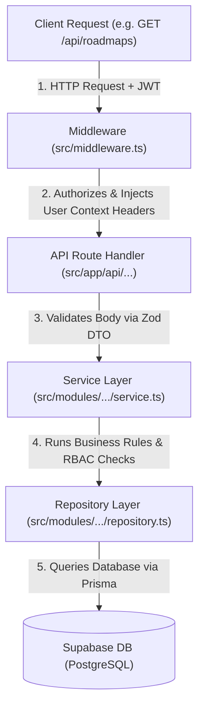

# PrepPortal Project Overview

This document provides a single, visual, and highly structured reference to understand the PrepPortal backend, database, and navigation flow in one go.

---

## 🏗️ Core Architecture & Navigation Flow

PrepPortal is built on a **Modular Monolith** pattern, keeping each business feature (e.g. Auth, Bookmark, Test) isolated. Below is the request and data flow:



---

## 📂 Annotated File Structure Blueprint

The backend divides source code into **Domain Modules** (`src/modules/`) and **API Endpoints** (`src/app/api/`):

```
PrepPortal/
├── prisma/
│   └── schema.prisma           # [Database Schema] Defines User, Workspace, Subject, Topic, Question models
├── scripts/
│   └── diagnose.ts             # [Diagnostics Tool] Verifies env secrets, connection pool, and direct migration URL
├── src/
│   ├── app/
│   │   └── api/                # [Routing Directory] Handles API requests; keeps logic lightweight
│   ├── common/                 # [Utilities] Shared authentication helpers, custom error classes, and parser helpers
│   ├── generated/              # [Prisma Client] Type-safe ORM client generated by Prisma 7 (not checked into git)
│   ├── lib/                    # [Third-Party Wrappers] Instantiates PrismaClient with the PrismaPg postgres driver adapter
│   ├── middleware.ts           # [API Gateway] Global JWT validation and path-based role checking (ADMIN/SUPER_ADMIN)
│   └── modules/                # [Domain Logic] Feature encapsulation containing Controllers, DTOs, Repositories, and Services:
│       ├── admin/              # System metadata dashboard
│       ├── analytics/          # Workspace progress statistics
│       ├── auth/               # User registration and JWT issuance
│       ├── bookmark/           # Question and topic bookmarks
│       ├── company/            # Target preparation company setup
│       ├── document/           # PDF parser/ Fast API document vector ingestion
│       ├── question/           # Coding, MCQ, theory questions
│       ├── roadmap/            # Subject/Topic learning tracks
│       ├── subject/            # Subject categories (e.g. Data Structures)
│       ├── subtopic/           # Detailed subtopic levels
│       ├── test/               # Mock assessments and grading
│       └── workspace/          # Tenant isolation & student history
```

---

## 🧭 API Navigation Map

The API routing uses Next.js App Router route handlers which delegate logic directly to the corresponding controllers:

| Endpoint Path | Method | Auth Required | Downstream Controller Method | Description |
| :--- | :--- | :---: | :--- | :--- |
| `/api/auth/register` | `POST` | ❌ | `authController.register` | Registers a new user |
| `/api/auth/login` | `POST` | ❌ | `authController.login` | Authenticates user & issues JWT |
| `/api/workspaces` | `GET`/`POST` |   | `workspaceController.list` / `.create` | Lists or creates student workspaces |
| `/api/workspaces/[id]` | `GET`/`PATCH` |   | `workspaceController.get` / `.update` | Fetches/renames a workspace |
| `/api/roadmaps` | `GET` |   | `roadmapController.getRoadmap` | Fetches active roadmap structure |
| `/api/analytics` | `GET` |   | `analyticsController.getStudentMetrics` | Compiles student metrics for active workspace |
| `/api/tests` | `GET`/`POST` |   | `testController.list` / `.create` | Manages mock assessment tests |
| `/api/tests/[id]/submit`| `POST` |   | `testController.submit` | Submits answers and grades test |
| `/api/bookmarks` | `GET`/`POST` |   | `bookmarkController.list` / `.add` | Manages workspace-pinned questions |
| `/api/admin` | `GET` | `ADMIN` | `adminController.getMetadata` | System administration metadata dashboard |

---

## 🗄️ Database Relations Hierarchy

All database records are mapped inside [schema.prisma](file:///Users/adityaverma/Desktop/PrepPortal/prisma/schema.prisma) and organized using workspace tenant isolation:

```
         [User] (Represents students and admins)
            │
            ▼ 1 : *
      [Workspace] (Tenancy isolation container)
            │
      ┌─────┴─────────────────────┐
      ▼ 1 : 1                     ▼ 1 : *
  [Roadmap] (Learning Path)   [Bookmark] (Pinned questions)
      │
      ▼ 1 : *
  [RoadmapNode] (Tracks LOCKED / COMPLETED topic status)
      │
      ▼ 1 : 1
   [Topic] ◄───Prerequisites───► [TopicPrerequisite] (Self-referencing relationship)
      │
      ▼ 1 : *
  [Subtopic] ➔ [StudyLink] (Resource links to GeeksforGeeks, Docs)
      │
      ▼ 1 : *
  [Question] (Coding, debug, theory, options)
      │
      ▼ 1 : *
   [Attempt] (Logged answers & score percentages)
```

---

## 🚀 Key Architectural Guidelines

> [!TIP]
> - **Lightweight Routes**: Route handlers only parse params, invoke the validation schema, and run the controller.
> - **Service is Brain**: Services contain all business rules, loops, and evaluations.
> - **Repository is Data**: Repositories contain query syntax (`prisma.user.findFirst`) and database calls only.
> - **Workspace Sandbox**: Always pass `workspaceId` and `userId` context downstream to protect workspace data privacy.
