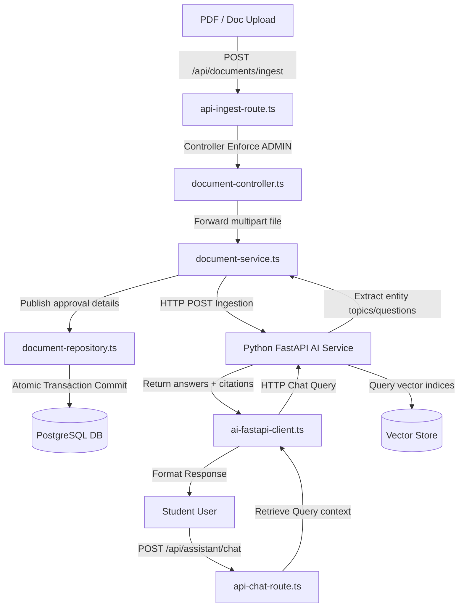

# RAG Pipeline Reference Directory

This directory compiles all backend files implementing the Document Ingestion, Parsing, and Vector Query (RAG) assistant pipeline.

## Pipeline Architecture

## Directory File Map

1. **[document-controller.ts](file:///Users/adityaverma/Desktop/PrepPortal/rag-pipeline-reference/document-controller.ts)**: Handles admin authorization checks and parsing requests.
2. **[document-service.ts](file:///Users/adityaverma/Desktop/PrepPortal/rag-pipeline-reference/document-service.ts)**: Forwards documents to the python vector store service and parses status metrics.
3. **[document-repository.ts](file:///Users/adityaverma/Desktop/PrepPortal/rag-pipeline-reference/document-repository.ts)**: Implements database queries and model constraints inside transactions.
4. **[api-ingest-route.ts](file:///Users/adityaverma/Desktop/PrepPortal/rag-pipeline-reference/api-ingest-route.ts)**: API routing handler endpoint for file uploads.
5. **[api-chat-route.ts](file:///Users/adityaverma/Desktop/PrepPortal/rag-pipeline-reference/api-chat-route.ts)**: API routing handler endpoint for client queries.
6. **[ai-fastapi-client.ts](file:///Users/adityaverma/Desktop/PrepPortal/rag-pipeline-reference/ai-fastapi-client.ts)**: Python FastAPI gateway wrapper.
